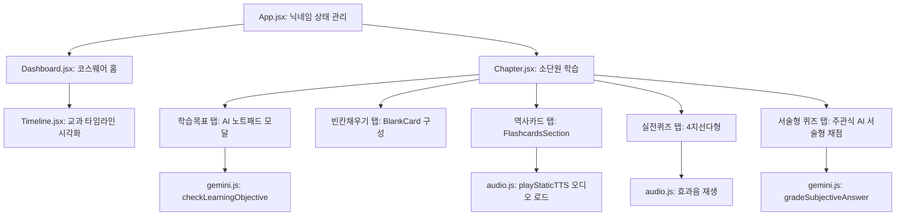

# 🏛️ 컴포넌트 아키텍처 및 AI 연동 분석 (Component & AI Architecture)

이 문서에서는 플랫폼의 프론트엔드 UI 컴포넌트 유기적 관계와, 핵심 기능인 **Gemini AI 채점/피드백 연동 설계**에 대해 다룹니다.

---

## 1. 핵심 컴포넌트 관계도 (Component Flow)

애플리케이션은 라우터(`react-router-dom`)를 이용해 대시보드와 과목별 상세 단원 페이지를 오갑니다.



---

## 2. Gemini AI 연동 모듈 (`src/utils/gemini.js`)

AI 채점 모듈은 브라우저 환경에서 경량 API 클라이언트로 직접 Google AI Studio 엔드포인트에 쿼리하여 **1초 내외**로 응답을 가져옵니다.

### A. 학습 목표 달성 서술형 채점 프롬프트
- **API 함수**: `checkLearningObjective(objective, referenceData, userDescription)`
- **동작**: 소단원별 학습 목표(Objective)와 함께, 참고 리소스로 `flashcards`(용어 사전)와 `fillInTheBlanks`(설명글 및 정답쌍) 정보를 프롬프트에 동시 주입합니다.
- **점진적 비계 설정(Scaffolding) 피드백 튜닝**:
  - AI에게 학생의 텍스트에서 빠진 부분이 많더라도 **한 번에 다 말하지 않고, 1~2개씩 힌트형 질문으로만 피드백**을 주도록 시스템 지침을 적용했습니다.

```text
중요: 누락되거나 틀린 점이 여러 개 있더라도 피드백에는 한 번에 모두 나열하지 말고,
가장 중요하거나 먼저 해결해야 할 1~2가지에 대해서만 힌트를 주는 질문이나 유도 문장으로 피드백을 작성하세요.
학생이 직접 스스로 생각하고 내용을 보완할 수 있도록 돕는 것이 목적입니다.
```

### B. 주관식 서술형 평가 채점 프롬프트
- **API 함수**: `gradeSubjectiveAnswer(question, expectedAnswer, userAnswer)`
- **동작**: 문제 질문과 모범 답안을 바탕으로 학생의 답안을 A/B/C 등급으로 판정하고, 격려와 보완사항이 가미된 개인화 피드백을 반환합니다.
- **반환 구조 (JSON Schema)**:
  ```json
  {
    "grade": "A" | "B" | "C",
    "feedback": "피드백 문자열"
  }
  ```

---

## 3. 타 과목 적용 시 AI 프롬프트 최적화 가이드

만약 수학이나 외국어(영어)와 같이 역사 과목과 채점 성격이 다른 과목에 AI 채점을 연동하고자 할 때는 `src/utils/gemini.js` 내의 `prompt` 정의를 다음과 같이 유연하게 보완할 수 있습니다.

### 📐 수학 과목 커스텀 힌트
수학은 서술 풀이 과정 및 수식 계산 오류 피드백이 중요하므로 다음과 같이 지침을 튜닝합니다:
> "학생의 답안 풀이 과정에서 논리적 오류가 일어난 첫 단계(예: 약분 실수, 이항 실수)를 검출하여 정답을 바로 제시하지 말고 풀이 과정 유도 질문을 힌트로 제공해 주세요."

### 🔤 영어 과목 커스텀 힌트
영어 단어나 영작, 문법 달성 목표 채점일 경우:
> "문법적 오류가 있거나 시제, 단수/복수 처리가 틀린 단어를 1개 짚어주고, 올바른 문장 구조로 고쳐 쓰도록 영어 문법 힌트를 제공해 주세요."
