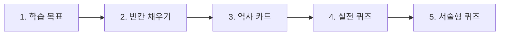

# 🎓 학습 워크플로우 및 게임 메커니즘 (Learning Workflow & Game Mechanics)

본 플랫폼은 단순히 역사 교과 내용을 암기하는 것을 넘어, **이해 -> 각인 -> 서술 -> 최종 확인**으로 이어지는 선순환 학습 피드백 루프와 게임화(Gamification) 요소를 결합하여 몰입감을 최대로 제공합니다.

---

## 1. 단원별 5단계 코스웨어 워크플로우

소단원을 학습할 때 사용자는 화면 상단의 5가지 탭을 순서대로 진행하며 학습 내용을 점진적으로 정복합니다. 상세 코드는 [Chapter.jsx](file:///Users/jihoonkim/Library/CloudStorage/GoogleDrive-yojihun@e-mirim.hs.kr/내%20드라이🇧ᅳ/CodingAI/history.ms.2-1-2/history-app/src/pages/Chapter.jsx)에서 탭 형태로 분기 관리됩니다.

### 1단계: 학습 목표 (이해 및 서술)
- **개념**: 단원을 공부하기 전 반드시 알아야 하는 교육과정 목표입니다.
- **활동**: 학습자는 목표를 클릭하여 **학습목표 달성 노트패드**를 열고 스스로 소단원의 개념을 요약해 서술합니다.
- **AI 튜터 연동**: 작성 시 AI의 즉각적인 진단 및 힌트 도우미([gemini.js](file:///Users/jihoonkim/Library/CloudStorage/GoogleDrive-yojihun@e-mirim.hs.kr/내%20드라이🇧ᅳ/CodingAI/history.ms.2-1-2/history-app/src/utils/gemini.js))를 활용해 서술의 성취 여부를 체크받습니다.

### 2단계: 빈칸 채우기 (각인)
- **개념**: 역사 교과의 흐름과 중요한 사건들을 줄글 형식으로 복기합니다.
- **활동**: 문장 사이사이에 뚫린 핵심 용어 빈칸의 덮개를 마우스나 손가락으로 탭하여 뒤집으며, 맥락적 학습을 완성합니다.

### 3단계: 역사 카드 (용어 정복)
- **개념**: 빈칸 학습에서 마주친 핵심 사건, 문화재, 인물 등의 개념을 카드형 매체로 파헤칩니다.
- **활동**: 4가지 인터랙티브 미니 게임을 통해 지루함 없이 단어를 외웁니다.
  1. *뒤집기*: 앞면(용어)과 뒷면(설명)을 뒤집어가며 학습하고 맑은 한국어 성우 발음(정적 TTS)으로 읽어줍니다.
  2. *메모리 게임*: 흩어진 카드들 사이에서 용어 카드와 알맞은 설명글 카드의 짝을 맞추는 매칭 게임입니다.
  3. *객관식*: 용어에 대한 올바른 설명 4가지 중 정답을 선택합니다.
  4. *서술형*: 용어의 명칭을 직접 키보드로 받아쓰기하여 정확도를 기릅니다.

### 4단계: 실전 퀴즈 (중간 진단)
- **개념**: 소단원에서 학교 시험에 주로 출제되는 4지선다형 객관식 기출 유형입니다.
- **활동**: 문제를 풀고 채점 결과를 즉시 확인하며, 오답 발생 시 마스코트 피드백과 함께 상세한 출제 배경 해설을 정독합니다.

### 5단계: 서술형 퀴즈 (최종 완성)
- **개념**: 감점을 받기 쉬운 까다로운 주관식 서술형 학교 문항을 대비합니다.
- **활동**: 질문에 맞추어 자기 생각과 역사적 근거를 직접 줄글로 기입해 제출하면, 실시간으로 AI 채점기가 A/B/C 등급을 매겨 부족한 키워드 보완 피드백을 전달합니다.

---

## 2. 게임화(Gamification) 보상 설계

학습자의 성취 욕구를 극대화하기 위해 다중 프로필 시스템 하에 경험치, 레벨, 재화 시스템을 긴밀하게 연동했습니다.

### 경험치(XP) 및 보석(Gem) 획득 밸런스
- **퀴즈 정답**: 문제당 `+15 XP`
- **서술형 평가 완료**: `+30 XP` 및 `💎 +1` (우수 답안)
- **학습 목표 달성**: 목표당 `+50 XP` 및 `💎 +2`
- **레벨업**: 누적 `100 XP`마다 레벨이 자동으로 상승하며 전용 사운드와 함께 축하 모달이 개방됩니다.

### 은행나라 보물 상점 & 박물관
- **역할**: 학습 동기부여를 위한 메인 대시보드 내 인게임 상점 시스템입니다.
- **메커니즘**:
  - 학습 과정을 통해 열심히 모은 보석(Gem)을 활용하여 역사 속 희귀 보물(예: 빗살무늬 토기, 진시황 병마용, 조선왕조실록 등)을 해금할 수 있습니다.
  - 해금 완료된 보물은 **은행나라 보물 박물관** 전시관에 영구 전시되며, 학습자는 본인의 성취 정도를 유물 수집도로 시각화하여 관찰할 수 있습니다.

---

## 🔗 관련 문서 링크
- [프론트엔드 아키텍처 및 상태 관리 (frontend_architecture.md)](file:///Users/jihoonkim/Library/CloudStorage/GoogleDrive-yojihun@e-mirim.hs.kr/내%20드라이🇧ᅳ/CodingAI/history.ms.2-1-2/history-app/docs/frontend_architecture.md)
- [UI 디자인 시스템 가이드 (ui_design_system.md)](file:///Users/jihoonkim/Library/CloudStorage/GoogleDrive-yojihun@e-mirim.hs.kr/내%20드ラ이🇧ᅳ/CodingAI/history.ms.2-1-2/history-app/docs/ui_design_system.md)
- [API 및 오프라인 연동 가이드 (api_integration.md)](file:///Users/jihoonkim/Library/CloudStorage/GoogleDrive-yojihun@e-mirim.hs.kr/내%20드라이🇧ᅳ/CodingAI/history.ms.2-1-2/history-app/docs/api_integration.md)
